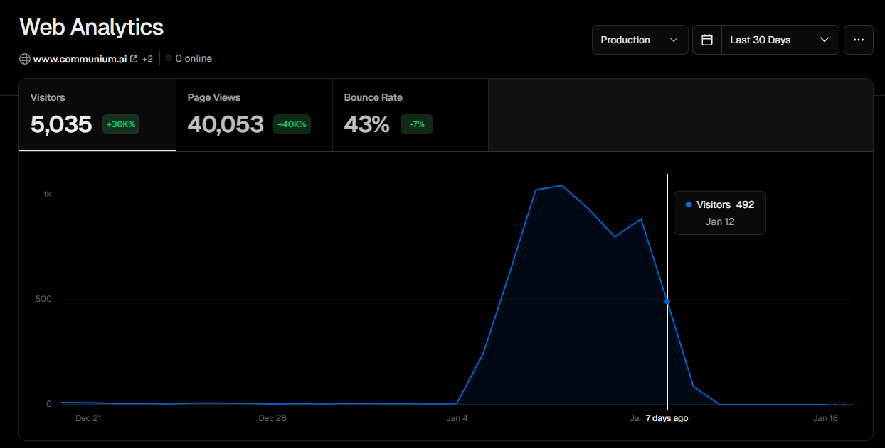

While still under development, I had what I found to be a very weird problem to have. The site was already launched, but no SEO nor promotion was done. It was basically under a hundred pages online, so I could test in a production environment on a real domain.

Suddenly I saw a traffic spike, which was very maintainable. I had seen those spikes on other projects before and it looked exactly like an SEO boost. A sudden, huge amount of visitors, ~6 months after the domain registration, work-hour fluctuations, growing almost overnight to a certain level and maintained over a period of time—it all looked like an awesome problem to have. At the moment I only had Vercel Analytics, which is very limited, so I couldn't dig deeper into things.



The first thing to do was to understand if the traffic was coming from search, so I had 2 things done:

1. Enable Google Search Console – to check if the website is indeed well-indexed and appears on Google
2. Enable Google Analytics – to understand the details of the traffic on the website.

Google Search Console is activated in just a few steps and takes about a day to collect data.

Meanwhile I decided to install Google Analytics. It also requires 1–2 days to collect data, but has a real-time report built in, so I went there and immediately spotted the first signs of the problem.

Most of the 30-minute active users came from a single city:


It means I am being attacked by a bot.

After ~36 hours, the Google Search Console and Google Analytics data was loaded and it confirmed the bot attack, as the domain was barely indexed and had almost 0 impressions. Which was expected, as I didn't even have a sitemap / robots.txt and basic on-page SEO done.


Given that every page load creates a pool connection to the database, it creates a serious pressure on memory, and especially egress, so it literally costs me money, and legit users might have a seriously undermined user experience, as during the bot loading a page the GitHub call is made to fetch real-time data, which means that if the bot is too active, legit users will not get the real-time data.


*Egress spike during bot attack.*

So, I had to do something and I had to do it now.

First, I tried a simple quick fix – and used Next's built-in functionality to check the headers to block the specific city.

```typescript
import { NextResponse } from 'next/server'
import type { NextRequest } from 'next/server'

/**
 * Middleware to block traffic from Lanzhou.
 * This checks common headers provided by CDNs like Vercel and Cloudflare.
 */
export function middleware(request: NextRequest) {
  // Get city from headers (case-insensitive check)
  const cityHeader =
    request.headers.get('x-vercel-ip-city') ||
    request.headers.get('cf-ipcity') ||
    request.headers.get('x-real-ip-city') ||
    request.headers.get('x-client-city') ||
    // Next.js on Vercel automatically populates request.geo
    (request as any).geo?.city

  // If city is Lanzhou, block the request
  if (cityHeader && cityHeader.toLowerCase() === 'lanzhou') {
    console.log(`Blocked request from city: ${cityHeader}`)
    return new NextResponse(
      JSON.stringify({ error: 'Access denied from your location' }),
      {
        status: 403,
        headers: { 'Content-Type': 'application/json' }
      }
    )
  }

  return NextResponse.next()
}

// Ensure the middleware runs on all paths
export const config = {
  matcher: '/:path*',
}
```

Unfortunately, it didn't have any effect, the bots continued to access my website freely.

So as a next step, I decided to implement Cloudflare and enable Country blocking. After a nameservers update and waiting for changes to take effect I enabled country blocking:

```
(ip.geoip.country eq "CN")
```

The next day I see this in the console. Just 1 event was blocked! However, the website is clearly being continuously attacked.


So, I start to dig deeper and find out this:


Apparently, the traffic is identified as Singaporean in Cloudflare, not Chinese, so I updated the rules to let's see…

And surely enough, after a few hours when I get back to check, the chart said:


That's how we like the bot signal on the website. Dead silent.
