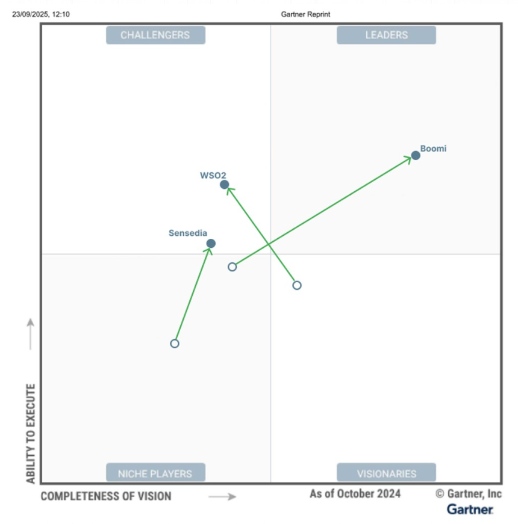
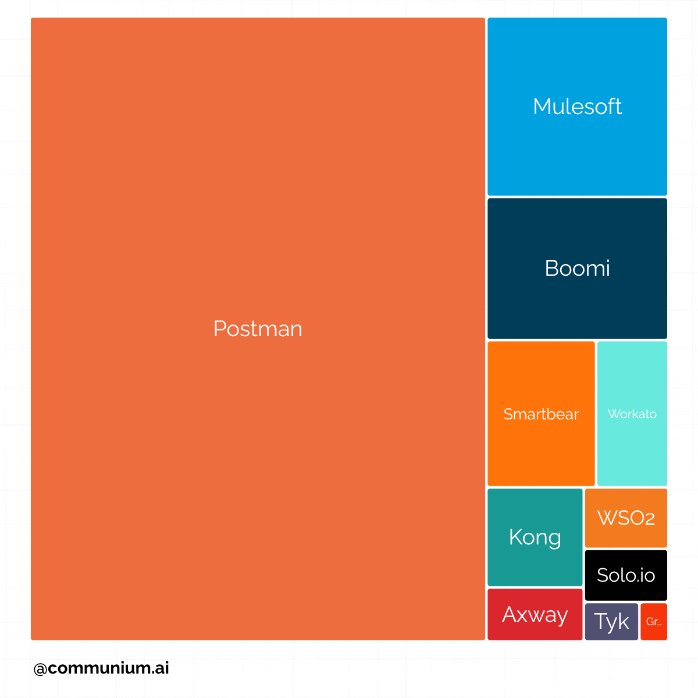

Spending a decade in devtools marketing made me hungry to understand how marketers are performing in different market segments. With this research I wanted to step back from familiar territory of CAD devtools and explore the competitive landscape of unified API management. From the first glance, this market is a bloodbath. The market is crowded, the demand is surging (especially with AI rise), and the strategies to reach buyers are evolving fast.

## Understanding the market

Consider a basic [Windows Calculator](https://github.com/microsoft/calculator), which integrates the Bing API for currency conversion. While simple, it illustrates the principle: no one needs isolated software without API access. APIM platforms solve this at enterprise scale, connecting hundreds of applications while maintaining governance, security, and performance.

According to [Statista](https://www.statista.com/statistics/1233538/average-number-saas-apps-yearly/), the average company uses 112 SaaS tools at any given time. Each of these apps needs to interconnect through APIs to ensure seamless workflows. Without a unifying layer, integration becomes a manual, error-prone process.

Unified API management platforms act as the middleman between API consumers (enterprises) and API providers (vendors). These platforms enable organizations to **plan, deploy, secure, operate, version-control, and monitor APIs**, ensuring every connection is reliable and maintainable.

---
## Understanding buyers’ expectations

APIM platforms in this research share following core features: 

**API Portal:** Think of it as a marketplace for APIs. Enterprises discover, evaluate, and consume APIs in a centralized environment. Providers register with the APIM platform to expose their APIs to consumers, streamlining onboarding and adoption.

**API Gateway:** This layer ensures consistency and reliability for every API call. For consumers, it provides transparent usage costs and predictable performance. For providers, it offers visibility into consumption patterns, allowing accurate forecasting of computational resources. Security, throttling, and monitoring are handled centrally, benefiting all parties.

**Governance:** APIM platforms enforce version control, data format consistency, and clear deprecation policies. Enterprises can trust that upgrading to a new API version won’t break their existing workflows—or they are informed explicitly if backwards compatibility is broken.

The portal, gateway, and governance are core features of unified APIM platforms.

---
## Understanding competitive landscape

The unified API management market is crowded, this is why I was especially interested in it in the first place. Some of the players are: 

| **Company** | **Product** |
| --- | --- |
| Amazon | AWS API Gateway |
| Axway  | Amplify Platform |
| Boomi  | Enterprise platform  |
| Google | Apigee API Management |
| Gravitee.io | API Management |
| IBM  | API Connect |
| Kong | Konnect |
| MSFT | Azure API Management |
| Postman | PLATFORM |
| MuleSoft | Anypoint Platform |
| SAP | Integration Suite |
| Sensedia  | API Platform |
| SmartBear  | API Hub |
| Software AG |  webMethods API Gateway |
| solo.io  | Gloo gateway |
| Tyk Technologies | Tyk |
| WSO2 | API Management |

## What does it mean for GTM?

In a crowded APIM market, product features are largely comparable across competitors, so differentiation must come from strategic positioning rather than technical uniqueness. Marketers need to craft messaging and go-to-market approaches that clearly define where and how their product stands out.

I suggest the following strategies:

- **Adjust pricing for startups or enterprises:** Appeal to either large enterprises or startups without attempting a ‘one-size-fits-all’ approach.
- **Focus on a specific market segment:** Position the product for industries such as finance, education, government, manufacturing, insurance, agriculture, logistics, or retail, and double down on the unique pain points of those markets.
- **Target specific regions:** Prioritize regions where exposure to major vendors is limited due to geopolitics or sanctions, or where API adoption is currently low but growing rapidly, such as emerging economies.

---

## Three Vendors Reshaping the API Management Landscape
The API Management space is seeing significant evolution, with recent Gartner Magic Quadrant reports revealing key players making substantial moves. These shifts represent fundamental changes in how vendors approach managing enterprise API ecosystems at scale.

- **Boomi: The M&A-Powered Leader**
Boomi's ascent from Niche Player to Leader exemplifies how strategic acquisitions can accelerate market positioning. The purchases of APIIDA and Mashery filled gaps in API lifecycle management and developer experience. By integrating APIIDA's design and governance capabilities with Mashery's gateway infrastructure, Boomi created a platform addressing enterprise API needs. Their AI-centric approach embeds intelligence for API discovery, anomaly detection, and automated governance by default.

- **Sensedia: The Vertical Specialist**
Sensedia's promotion to Challenger status reveals a playbook focused on vertical dominance over horizontal expansion. The company doubled down on financial services in Latin America's Open Finance ecosystem, where regulatory mandates created opportunity. Brazil's Central Bank mandate for Open Banking made API standardization, security, and compliance existential requirements, and Sensedia positioned itself as the infrastructure provider. Their AI Gateway manages LLM-powered applications for financial institutions embedding generative AI into customer experiences.

- **WSO2: The Private Equity Resurgence**
WSO2's transformation under EQT ownership demonstrates how private equity backing can reignite a mature product's trajectory. The EQT investment injected capital into AI integration, federated governance for multi-cloud environments, and enterprise analytics through the Moesif acquisition. WSO2's architecture allows policy enforcement across AWS, Azure, GCP, and on-premises infrastructure without forcing a centralized chokepoint. The platform appeals to organizations that want control without vendor lock-in.

---

## Online presence
I explored the Gartner Magic Quadrant for Unified API Management and began wondering how closely those analyst rankings align with online visibility.

1️⃣ Do the “Leaders” in the quadrant also dominate online attention? 
2️⃣ Does strong digital presence actually translate into market leadership?

To answer these questions, I turned to SEMrush. Out of a total estimated 2.2M monthly visits in the APIM space, Postman attracts roughly 1.6M, while the rest of the market shares the remaining 28.5% ❗ 

Interestingly, Gartner decreased Postman’s position in 2025 Magic Quadrant — lowering both its completeness of vision and ability to execute.

That raises an interesting contrast:
Postman enjoys unmatched online visibility, but faces challenges in turning that awareness into revenue growth. A possible reason lies in its generous free tier (free for teams under three developers), which helps it dominate awareness among developers but makes conversion to paid plans a constant battle.

📊 Data note
Organic traffic estimates are sourced from SEMrush, which models keyword rankings, Google search volume, and anonymized clickstream data. While directionally accurate for large domains, figures may vary ±20–30%. Use them as relative visibility benchmarks, not exact analytics.

---

## Self-Hosted vs Cloud-first API Management

In the high-stakes world of financial regulation, "trusting the vendor" is no longer a viable legal strategy. When the SEC or FINRA comes calling, they don't subpoena your cloud provider’s marketing materials—they subpoena **you**. For the modern financial executive, the choice of infrastructure is no longer just a technical box to check; it is a determination of your personal and professional liability.

### 1. The Illusion of Outsourced Risk

**Outsourcing your infrastructure does not mean outsourcing your accountability.** Many financial institutions migrate to cloud-first API gateways under the impression that the vendor’s compliance certifications (SOC2, ISO 27001) act as a shield. However, regulators are increasingly indifferent to who hosts the data; they care exclusively about who governs it. If a "black box" cloud vendor suffers a visibility gap or a data leak, the fines and the reputational fallout land squarely on your institution's balance sheet, not the vendor's.

**The $35 Million Reality Check.**

In 2023, Morgan Stanley was hit with a $35 million penalty precisely because of inadequate data governance and the inability to produce timely audit evidence. The failure wasn't necessarily a lack of security, but a lack of *oversight*. When you rely on a third-party cloud-only solution, you are at the mercy of their logging schedules, their data retention policies, and their support ticket response times. Self-hosting eliminates this "middleman risk" by keeping the entire API infrastructure—and the evidence it generates—under your direct physical and digital control.

### 2. Direct Oversight vs. Visibility Gaps

**You cannot be held accountable for what you cannot inspect.** Cloud-abstracted systems are designed for convenience, which often means hiding the "messy" technical details of how traffic is routed and how keys are managed. For a developer, this is a feature; for a compliance officer, it is a blind spot. In a unified API management environment, having "visibility" isn't just about a pretty dashboard; it’s about having unfettered access to the underlying configuration and raw logs.

**Bridging the "Gap of Ignorance."**

The SEC fined First American Financial nearly $500,000 because their reliance on third-party vendors created "visibility gaps" that led to cybersecurity control failures. They didn't know what they didn't know because the vendor’s platform didn't allow them to look under the hood. Open-source, self-hosted model ensures there are zero external dependencies for compliance reporting. You own the encryption keys, you define the security policies, and you have the power to modify the infrastructure at the code level to meet new regulatory demands instantly.

### 3. Career Sovereignty and the CISO’s Future

**Today’s infrastructure choices determine tomorrow’s executive vulnerability.** We have entered an era where regulatory failures are no longer just corporate "cost of doing business" events—they are career-defining, and sometimes life-altering, moments. As a CISO or CTO, your best defense is a "Zero Dependency" architecture that allows you to answer any regulatory question with 100% certainty, without waiting for a vendor to "get back to you."

**The Precedent of Personal Liability.**

The 2023 fraud charges against SolarWinds CISO Timothy Brown sent a shockwave through the industry. The core of the allegation was that misleading statements were made about security controls that the executive didn't have full, granular control over. By choosing self-hosted, you are choosing a "future-proof" architecture that won't require a "rip-and-replace" when the next SOX or GDPR-style regulation is enacted. You are maintaining data sovereignty, ensuring that when you sign off on a compliance report, you are doing so based on infrastructure you directly manage.

### 4. Building a Defensible Perimeter

**The goal of self-sovereign API management is to ensure the auditor’s visit is a non-event.** When you control the infrastructure, you control the narrative of the audit. You aren't scrambling to find out where your logs are stored or why a third-party policy change suddenly broke your compliance chain. You are the sole source of truth for your API traffic, protecting both your institution’s reputation and your own professional standing.

**Taking the Keys Back.**

Self-hosting a self-contained disaster recovery and business continuity plan that functions even if every major cloud provider has an outage. It moves your organization from a posture of "hopeful compliance" to one of "defensible sovereignty." In the eyes of a regulator, there is no greater sign of maturity than an executive who can point to their own infrastructure and say, "I have total oversight here."