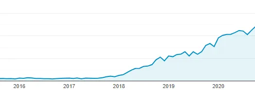
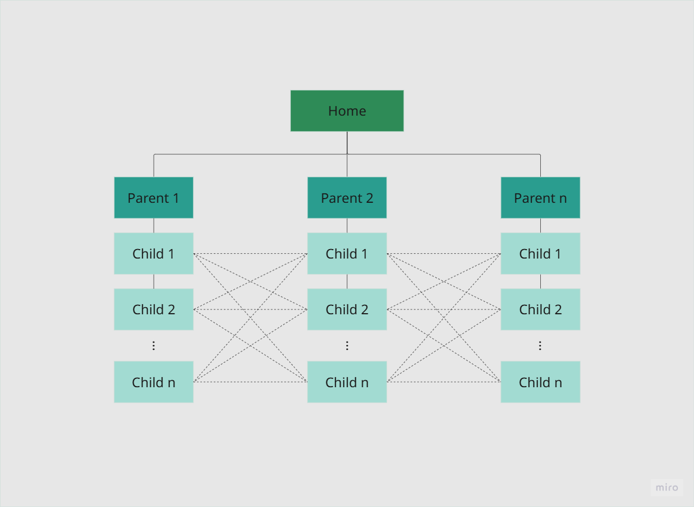

--- 

title: "30x Growth Initiative"
description: "Keyword research, templated content, and automation to generate 10K+ landing pages."
date: "May 15 2025"
thumbnail: "/traffic-growth.png"

---

  <a class="animate">
    <h3>🚀 30x visitors</h3>
  </a>
  <a class="animate">
    <h3>🎯 1000s of leads</h3>
  </a>
  <a class="animate">
    <h3>📚 Content at scale</h3>
  </a>

## Challenge

Early on, we had product–market fit in sight. Our SDK for 3D file conversion was gaining traction, with a few hundreds engineers visiting our site monthly and converting at an impressive 15%+. But the math didn't work out. High conversion with low traffic doesn't scale. I needed volume.

But, how to drive traffic to a no-name startup and compete with established players without a big budget or a team of content writers? In a lean, bootstrapped startup, I didn't have the luxury of paying for ads or building backlinks at scale. The traditional content marketing model —write high-quality, long-form blog posts, wait for organic traffic to grow — wasn't an option. 

## Choosing What to Build: Keyword Research

I started with manually researching what people searched around our product category. I wasn't looking for vanity keywords. Used Ahrefs, SimilarWeb and Google Search Console to pull thousands of potential long-tails. Grouped these into **"content pillars"**, specific to our product like:

- CAD file conversion
- CAD file visualization
- DFM issues (e.g. "Minimum hole diameter in sheet metal")

This gave me a Google Sheet with the prioritized list of thousands of keywords to target. 

## The Stack: Joomla, Custom Modules, and Automated Generation

Note, it was 2017, and I couldn't even dream about Astro yet. Here's what my stack looked like:

- **Joomla CMS**: I didn't use a fancy static site generator. Joomla with a few hacks could do the job.
- **Custom Joomla Modules**: I developed modular components for content blocks. Each block was dynamic, drawing in keyword data, allowing me to swap the content on the fly without rewriting entire pages.
- **Google Sheets**: We didn't use a complex database to power this — just a simple spreadsheet that could deliver what we needed efficiently.
- **Automation**: Using a custom script, I automated the creation and deployment of these pages. Once the content blocks were in place, scripts pulled keyword sets from a data pool and generated landing pages in bulk.

The system allowed me to generate over 3K optimized pages per content pillar, ultimately creating 10K+ new landing pages.

## Distribution & Indexing: Getting Google to Care

I followed three key rules to ensure fast indexing and ranking:

1. **Internal linking at scale**: Each new page linked back to its pillar hub and all of the sibling pages.

One Counterintuitive Lesson: Internal Links Beat Backlinks (At First)

I assumed I needed tons of backlinks to rank. But in our niche, a tight **internal linking structure**  — with semantic hubs — outperformed low-effort outreach. 

2. **Structured metadata**: Title, H1, H2, H3, URL slugs, keyword density (1–2%), and schema.org markup where relevant.
3. **Crawl facilitation**: Auto-generated `sitemap.xml` files nightly and pinged Google Search Console with updated URLs.

No backlink campaigns. Just **relevance + structure**.

## Why It Worked

- **Engineer-mindset marketing**: Instead of "campaigns," I built evergreen content system.
- **Templates > blog posts**: I moved from hand-crafted articles (6–8 hours each) to structured content at scale (minutes to deploy).
- **Search intent alignment**: Every page answered a real question someone typed into Google. No fluff.

## Results

Within **3 months**:

- **Organic traffic**: 1.5K → 5K+ monthly visitors
- **Conversions**: Held steady at ~12–14% (no quality drop)
- **Indexed pages**: ~7,000 across 3 content pillars
- **Top 3 rankings**: 90+ new long-tail keywords
- **#1 spot** for high-intent searches like "Convert STEP", "Convert SolidWorks"

And it keep compounding to these days. Every new page was a new door into the product.