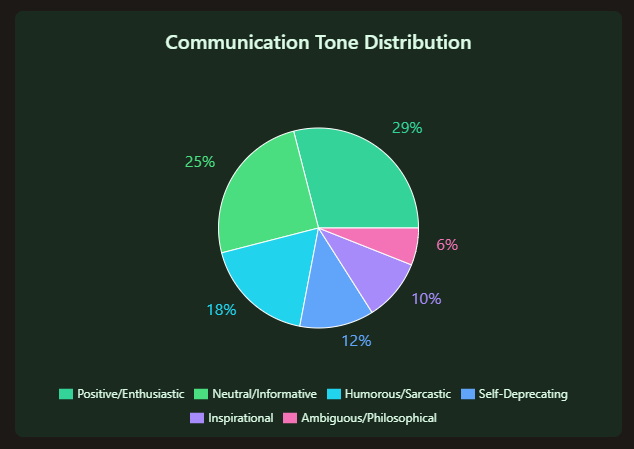
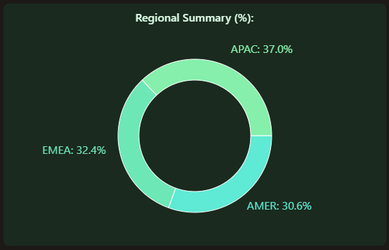
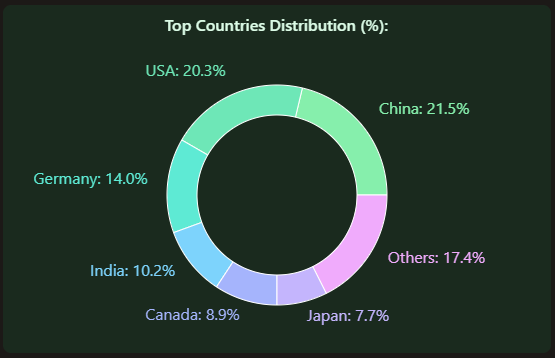

--- 

title: "Project 'Stargaze'"
description: "Analyzed 34K CAD/CAM/CAE GitHub stargazers to refine messaging."
date: "June 06 2025"
thumbnail: "/GitHub__headpic.webp"

---
Analyzed 34K CAD/CAM/CAE GitHub stargazers to refine messaging and target positioning.

## Methodology

GitHub stars are often dismissed as vanity metrics. But they're behavioral breadcrumbs—tiny indicators of curiosity, alignment, or intent.

With Stargaze, I set out to turn these signals into structure. I analyzed five of the most-watched open-source CAD/CAM/CAE repositories: OCCT (1.1K stars), FreeCAD (18.7K), SolveSpace (3.1K), OpenSCAD (6.8K), LibreCAD (4.3K).

From these, I crawled and parsed **34K stargazers**. For each profile, I extracted 12 fields including:

- bios
- job titles
- companies
- locations
- social handles
- Other public data

This isn't just data collection. It's **market mapping**. These stars tell us who's paying attention to open CAD—and how their attention might convert into influence, contribution, or adoption.

GitHub stars are **early signals of product-market alignment**. Treated correctly, they're a lead pipeline for product discovery and GTM insight.

## Profiling the CAD Crowd
CAD crowd stargazers reflect that ethos—with humor, edge, and engineering honesty.

Among bios, six **tone clusters** emerged:

The dominant voice is casual. Many bios riff on compiler pain, bad code, or the joys of hobbyist tinkering. Others flag their admiration for **open-source principles** or lifelong learning.

This tone matters. Engineers—especially in open-source ecosystems—signal their values through how they describe themselves. Jokes about "spaghetti code" or "fighting with CMake" are shorthand for lived experience and technical culture.

Bio tone reveals not just personality, but user alignment. You can't build PLG for engineers without respecting how they self-describe and what they signal about their worldview.

## Titles and Roles—Not Just 'Developers'

It's easy to flatten GitHub users into "devs." But **job titles—and the structure behind them**—tell a richer story.

Among FreeCAD stargazers, I found:

1. Software Engineer
2. Developer
3. Engineer
4. CTO

Other titles flagged specialized domains: Embedded Systems, iOS, Security Ops, Generative AI Consultant.

What emerges is a spectrum—from students and freelancers to senior decision-makers and R&D leads. The presence of CTOs and consultants alongside hobbyists shows that FreeCAD's pull cuts across role seniority and motivation.

For any devtools company, this signals a need for **multi-tiered messaging**. Outreach to a freelancer who contributes for fun differs from a CTO evaluating stack fit for a new CAD automation feature.

## Mapping the Globe—Where Open CAD Lives
The open CAD community isn't anchored in Silicon Valley. Its **geography is distributed**—and its centers of gravity often unexpected.

And then there are the **outliers**—bios listing their location as "Laniakea," "Milky Way," or "Earth-616." These are jokes, yes, but also cues about engineering humor and identity.

This global distribution matters for **GTM and community-building**. CAD workflows in China, Germany, and India are shaped by different infrastructure, constraints, and regulatory norms. A one-size-fits-all go-to-market won't work.

Open-source CAD lives globally. GTM and product choices should **localize** based on where contributors actually are—not where your sales team sits.

## Who Employs These Engineers?
GitHub stars may be individual gestures—but they're often backed by **institutional context**. People bring their tools, interests, and influence into the companies they work for.

Among Stargaze profiles, we identified employers across the spectrum:

1. Big Tech: Google, Intel
2. Startups: Clicklease LLC, The Swarms Corporation, Fynd
3. Academia: IIT KGP, Hunan University, NTNU Norway, UCLA
4. Freelancers and indie devs: highly represented

**Stargazers bridge sectors**—academia, enterprise, startup. Devtools teams should track these bridges to forecast traction, not just vanity stars. Many flagged work in AI, robotics, or embedded systems. The takeaway is not just domain crossover—but tooling expectations. These are **polyglot users** who expect composability, extensibility, and open standards. 

They also act as **local nodes**—amplifying what they learn from GitHub into internal R&D or product evaluations. A star today might become a feature request or integration demand next quarter.

## Real People, Not Just Repos
GitHub stargazers aren't anonymous clicks. They're **high-resolution user signals**—if you're willing to look.

By extracting bios, roles, geos, and employers, Stargaze converts inert GitHub data into **active insight**. It turns open-source stars into a **GTM data layer**: a living map of influence, intent, and identity.

If you're building devtools—especially in manufacturing, CAD/CAM, or computational design—these users are your **earliest signalers**. They tell you what matters, where friction lives, and who might advocate for you inside an org.

Start using GitHub. People's GitHub trail already shows you how.